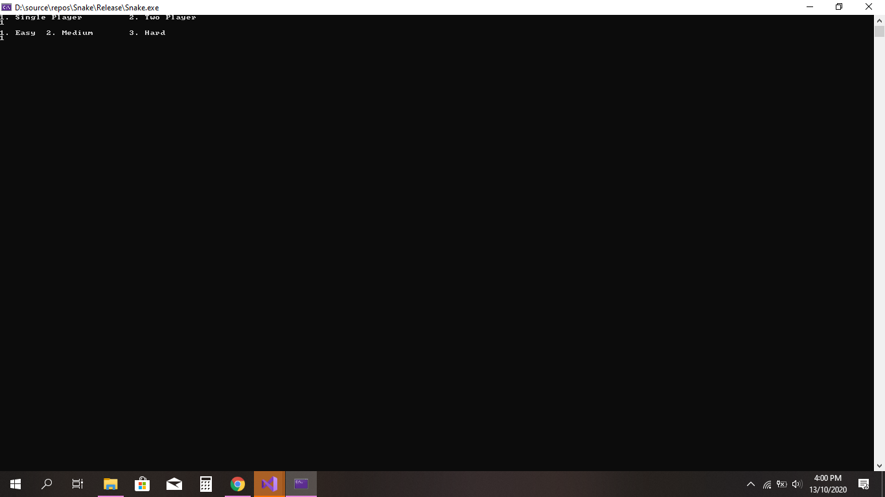
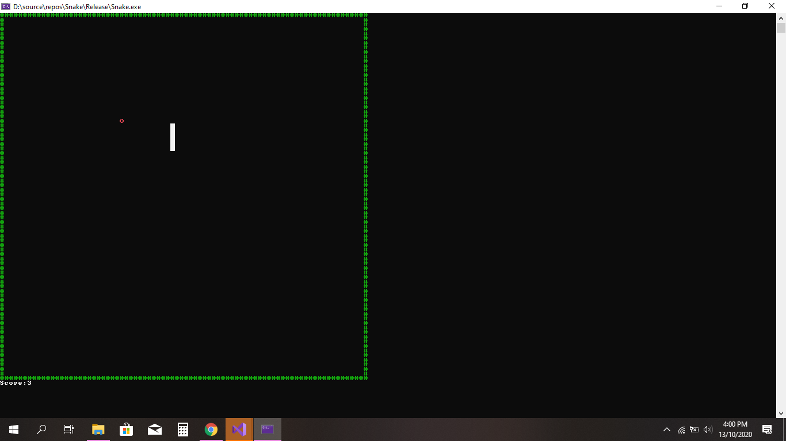
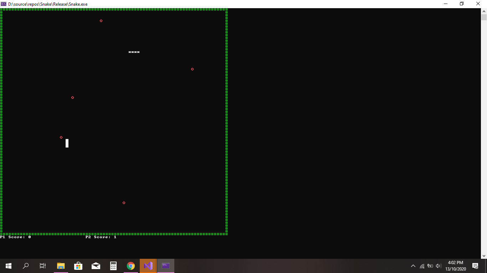
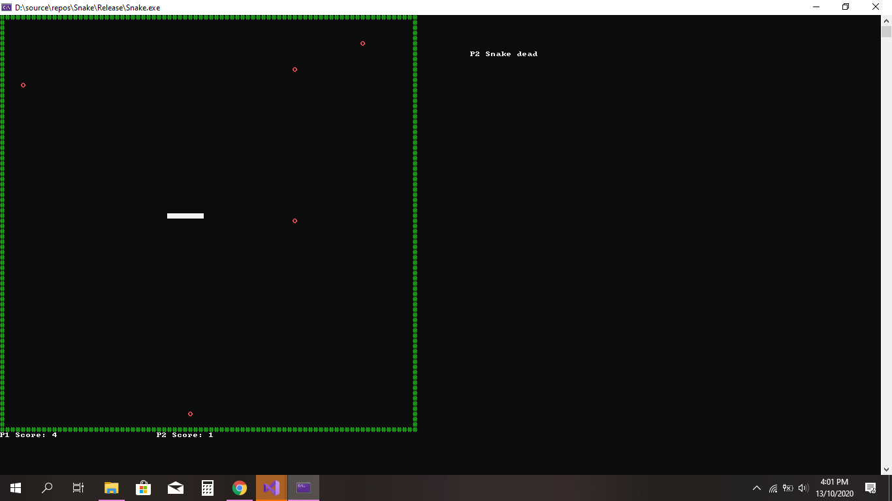
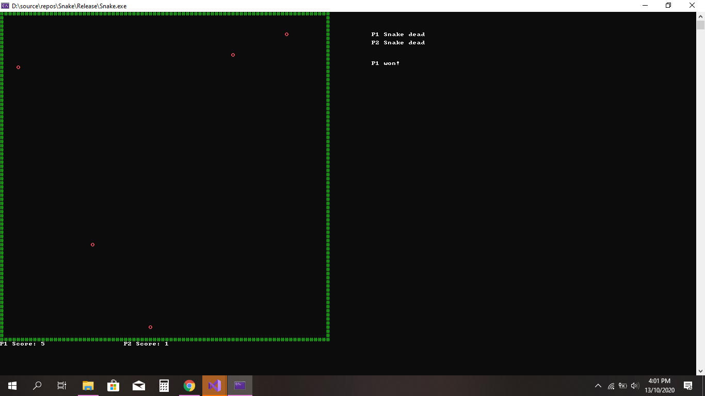

# Multiplayer_SnakeGame
A multiplayer (2-player) console snake game in C++

OOP is not utilized at all to save development time & to keep things simple.

Refer to the demo videos, to see gameplay.
Arrow keys are used for Player 1, WASD keys for Player 2.

Game start screen:

Single player mode:

Two player mode:

1 snake dead in 2-P mode:

Game over in 2-P mode:

